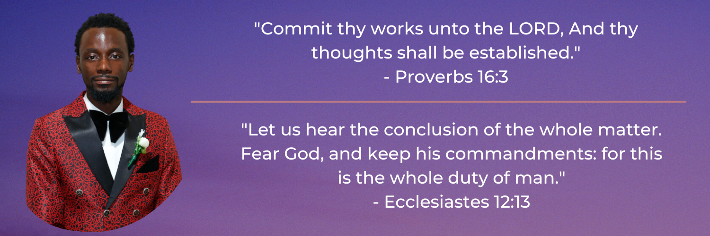

# **Sunday Obinna Oruwhone ✨**
***"To be sure is better than sure - Amos Olanrewaju Oruwhone"***[^1]

## Hi there 👋

### Get to know me more from my [CV](https://docs.google.com/document/d/1ocDekhxp9KxNqNtb6MkeAlDd9gDQ14vbsIGvzyYVK4I/edit?usp=sharing) or from my one-pager [Resumé](https://docs.google.com/document/d/1W4riSUmAR-9jOE98AILIzI74mzGna9xPSutxnap8-qU/edit?usp=sharing).

<!-- - 🤔 I’m looking for help with: `...`. -->
- 🔭 I’m currently working on improving my `Web Development` & `Software Development` skills.
- 🌱 I’m currently learning: `Software Engineering at ALX Africa`.
- 👯 I’m looking to collaborate on: `Web Development` & `Software Engineering` projects.
- 💬 Ask me about: `The Sun`, `Web Development and Tutoring`, `Software Engineering`, `Anything that Moves on Wheels`, and `Maths`.
- 📫 How to reach me: [LinkedIn](https://www.linkedin.com/in/0xOneBeing), [YouTube](https://www.youtube.com/@0xOneBeing), [Email](mailto:sundayoruwhone@gmail.com), [Twitter](https://www.twitter.com/0xOneBeing), [FaceBook](https://www.facebook.com/OxOneBeing), [Instagram](https://www.instagram.com/0xonebeing), [Telegram](https://t.me/OxOneBeing).
- 😄 Pronouns: `He/Him`.
- ⚡ Fun fact: `The last three letters of my surname are ONE and '✨' is my favorite emoji`.

---

| GitHub Stats | Most Used Languages |
| ----------- | ----------- |
|  |  |

---

[^1]: ***"To be sure is better than sure - Amos Olanrewaju Oruwhone"*** (d. December 3rd, 2013)".
